# PP3 dating game READ ME 

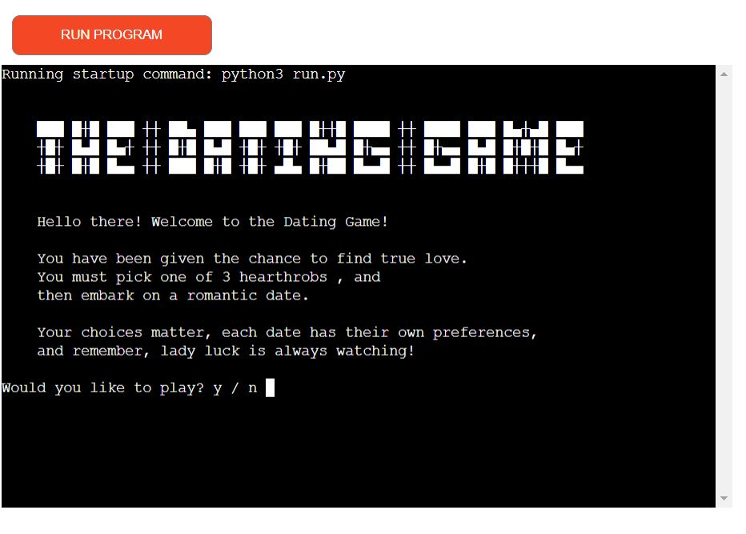

- The following read me file seeks to summarize the intent and implementation of the dating game python file. It was designed as part of the curriculum for code institute 
It will describe user experience, features, visual design, technologies, validation + testing and acknowledgements
- The respository on GitHub can be accessed from this link 
https://github.com/gazamcnulty/dating-game-pp3

- A live version of the game can be experienced via Heroku on the following link
https://dating-game-pp3.herokuapp.com/

## Table of Contents:
- Introduction and Summary
- Intent
- User Experience and User Stories
- Features and Design
- Technologies
- Validation and Testing
- Known bugs and issues
- Future updates places to improve
- Acknowledgements and Credits 

## Introduction and summary
The Dating Game is a program file that comprised of a text based dating game. It can be played in a terminal , or any python reading system. For the scope of the project, it is a text based python program file, so I have not included any other programming languages or files, such as HTML / CSS / Javascript.

Akin to old fashioned text adventures, the player must navigate various situations, but instead fantasy or battle encounters, this game is about romance and friendship. The game is supposed to be fun and amusing, with replay value. The player should have fun trying to determine what is the best response for different character dates, in different scenarios. Because it has a more grounded genre (dating / slice of life) as opposed to a typical rpg genre ( fantasy / science fiction) it should have a more broad appeal for a wider audience. I would hope this will mean more people will be willing to give it a go, beyond the typical audience for these types of games.

it allows the player to enter their name and roleplay as a suitor on a date. The main player agency comes from choices, in which they need to decide how to respond to different scenarios . The player gets to choose 1 of 3 characters they want to go on a date with. They get to choose other variables, such as when to go on the date and what to wear. Beyond these , there are a fixed amount of scripted events where the player has to decide how to respond, what to do or what to say. The ‘correct’ answers are not universal : one character may like something you said while a different character will dislike it. Favourable choices reward the character with ‘endearment’ points, unfavourable choices deduct points. The player starts with 5 endearment points, the end result of the date varies depending on how many points the player has. There are multiple endings for multiple characters.

Furthermore there are certain events that can immediately result in a game over. While this might seem unfair, the game is short so its not a huge loss if the player does fail. It would also (hopefully) encourage replays .

## Intent
I want the dating game to be a quick fun slice of life game that anyone can play. I want it to have broad enough appeal that anyone can give it a go. It’s text based so it can run on any program that read and runs python. In this instance a direct link to the heroku app can be provided , this could be shared between users to instantly load up the game. 

The subject matter of socialising, making friends, and dating are so universal that I think everyone can relate to some of the events that the game presents. This presents a low barrier of entry. As well as this, the game is short enough where you can get through from start to finish in a matter of minutes. I would hope this would be something fun for users to share and compare results / scores. The game features branching paths and scenarios , so users may find it amusing to compare anecdotes of how they fared in the game. Similarly, if user hears of another's result , they may want to try and achieve the same result to see it for themselves.

As well as the branching paths based on user choices, there are also a couple of random event scenarios that are triggered by a random number generator as opposed to a linear series of choices. This plus the fact that the game is short, means that most replays will be different and vastly increases the replay value of the game. A user who knows the game is short and sweet will be more likely to replay it, as opposed to if it was a long drawn out campaign. Its something you could share with a coworker on a lunch break , for a brief amusing distraction.

## User-experience/User-stories
**New users :** I want new users to find the dating game amusing and entertaining. It should be novelty to find a quick text based dating game, which presents both recognisable situations and bizarre random events that a user would find funny. I want the rules to be simple and explained clearly, so that even first time players are unlikely to trigger an error. Even if they do, the game will explain they typed the wrong option and allow them to try again. I want the game to be surprising for first time players by witnessing how it can result in an instant game-over based on the wrong choices. Since the game is so quick to restart, I would hope this would encourage them to give it another go and follow a different path. If they enjoy it enough, they would share the game with friends and compare results.

**New user story :** *"It was quiet Wednesday afternoon at work, I was waiting for my reports to generate so I could get to work on my next task. While waiting , a coworker sent me a link to ‘the dating game’. We had recently discussed dates we had been on and compared funny stories. With the link , my coworker joked that “The dating game should give me some practice before the next real date!”
I found this funny, and decided to give it a shot.

It was a simple enough text based game, it reminded me of the old D’nD style text games I used to play years and years ago on my dad’s computer. It explained simple enough rules, put in your name, answer a, b, c to the questions etc. I got to pick which person I wanted to go on the date with and when to have the date itself. Most of the questions were simple enough, like for example : in my scenario it was sunny so I chose to go for a walk in the park. This gained me point, which made sense. Similarly I knew my date liked lasagne so I ordered the same at the restaurant which also gained me points. 

Funnily enough, despite me thinking the game was so simple, at one stage I actually did mistype the wrong option, instead of a, b, or c. Luckily the game recognised an erroneous answer type and fed back to me that I had typed an unacceptable answer. It then presented the question again, allowing me to answer correctly this time.
It initially seemed like simple reading comprehension, until some weird questions and answers started coming up. I thought to compliment my date on being in good physical shape, but this actually lost me points as this particular character was self conscious about their physique. Then when a couple were arguing nearby , I chose what I assumed was the clever response: approach them with a friendly manner and offer to arbitrate. This actually lost me points when they threw a glass of wine in my face! 

I found these unexpected results funny, and while it might be considered ‘unfair’ in some ways , because the game was so short it didn’t bother me. The experience of witnessing the funny events was the real game, as opposed to the actual ‘quiz’ of knowing the right answer. I got more enjoyment from failing than from winning!
I unfortunately didn’t get a second date at the end of the game, but the game text was encouraging to me not to give up in the field of romance. While this was probably just encouraging me to replay, I actually liked the positive message it was trying to deliver, metatextually it was saying not to give up in this game, or in real life.

I did replay the game a few times, and I failed again in a couple of spectacular ways, one involving a brief prison sentence! I eventually won and was pleased with myself. I got to talking again with my coworker about the game and they shared some of their experiences which were totally different to mine. I decided to send it on to my sister as I thought she might get a laugh out of it, and lo and behold she really enjoyed it. She then forwarded it onto our mam and dad, so we all had a go!
I ultimately found it an amusing way to kill a few minutes on a quiet afternoon, the most fun was getting into random scenarios and comparing those with the experiences of others.*

**Return users :** I want return users to remember roughly how the game works, not only to reduce the likelihood of them experiencing errors but also so that they can skip past the introduction/rules if they want and speed up the game experience. If they can remember the results of some choices, they can use this knowledge to make better decisions and hopefully influence the game to get a better end score. Although the game should be experienced without knowing what will happen, I would also like players who gain a better understanding to be able to replay and deliberately incite certain scenarios. For example, if a user remembers that it was a bad idea to try and fight the robber, if they encounter that random event next time they can choose a different option. This may not necessarily win them the game , but it will show them a different result and ultimately give them more gaming content. I feel users who are able to learn the results , should be rewarded for this on replays, if they choose to play it again.
If a return user really wants to, they could even replay so many times with so many choices and results, they are able to map out what will occur from start to finish. This is unlikely to occur but at least the game is robust enough that if someone wants to master it , they can.

**Return user story :** "I remembered the dating game I had played last week. My coworker and I had shared stories on it, even members of my family had played it and shared it around. It got to the stage where someone looped around and shared it back to me , unaware I had been the one sharing it out last week!

Someone had told me it was possible to get the restaurant musician to play a song by Metallica which apparently results in your date getting a concussion.  It was another slow day at work so I decided to play it again and try to achieve this myself. I had a few run throughs but I didn’t seem to get any opportunity to affect the music.

I eventually found its a random event for the musician to ask if you would like a song, and although Master of Puppets might seem like the dumbest response , it actually results in a second date! In an unlikely turn of events, you and the date bond over rock music so much you end up agreeing to go to a gig next week. Funnily enough this is one of the few ways you can instantly ‘win’ the game! I was satisfied with this and I was glad I had decided to return to the game again for another few goes. 

**Frequent users :** I want frequent users to be able to get into the game and skip past the introduction parts as quickly as possible. I had initially had some time based mechanics affecting the text scrawl, whereby the text would appear slowly or line by line after certain delays. This made it more pleasant to read, however it really slowed down the game on replays. So much so that it reduced the replay value. I decided to remove the time mechanics besides on or two. I felt this was the better decision for replay value and frequent users. In the future I might consider adding an option at the start , like a ‘quick’ mode or something that asks if they want to skip the rules and intro, to get straight into the game.
It is not overly complex so I believe frequent users will know exactly how the dating game works. Although its a simple game, because of the short length and replay value I believe that there could be frequent users who might want to try to experience all the possible scenarios or answers . 

**Frequent user story :** 
After comparing stories with other players, I found there were some answers that dates had different responses to and some random events if you chose bizarre answers.
I thought that was funny so I decided to try to map out the logic or decision flow of the game. I compared my results with the same coworker who gave me her data which helped me map it out quicker.

I eventually found that the majority of the date goes the same for all 3, but whether you get points or not is the main thing that changes, if your answer is correct for the particular person you date.
Beyond this , there are some decisions that will instantly result in a game over, such as ordering Dr.Pepper or trying to fight the robber. The most bizarre events occur in the random encounter, which can include the arguing couple, a rat, a robber, a music request or a man choking. This required me to frequent the game multiple times hoping it would generate the random event I wanted. That was a 1 in 5 chance and even then each of the 5 random events had 3 possible responses , which had their own strange consequences.

Although this meant a lot of replays , I really didn’t mind since the game is so short you can fly through it really quickly. It got to the stage where I could skip the first few sections by hitting a sequence of keys, which I knew the system would accept as choosing the date, time, what to do, and food to order. This got me halfway through the game in a matter of seconds.
I eventually mapped out the entire flowchart of possible decisions and responses, I was happy the game was robust and replayable enough for me to achieve this.

## Structure / Features
Overall structure the dating game is comprised of 3 python .py files. run.py is the landing page which the heroku application presents. functions.py is another python file containing all of the functions being defined in order of how they would be called, through the process of the game. Finally profiles.py is the character profiles for the 3 matched characters that the user can choose to date. The profile info for each are stored in a dictionary, which is then called on to present the info in the run.py file.
Run.py is basically just the dating game logo, followed by all of the functions being called in order. It calls new game and rules functions from functions.py, then calls on the profile function from profiles.py. After this all of the functions are called in order , from functions.py.

Overall structure the dating game is comprised of 3 python .py files. run.py is the landing page which the heroku application presents. functions.py is another python file containing all of the functions being defined in order of how they would be called, through the process of the game. Finally profiles.py is the character profiles for the 3 matched characters that the user can choose to date. The profile info for each are stored in a dictionary, which is then called on to present the info in the run.py file.
Run.py is basically just the dating game logo, followed by all of the functions being called in order. It calls new game and rules functions from functions.py, then calls on the profile function from profiles.py. After this all of the functions are called in order , from functions.py.

I had initially intended to keep all of the code on just run.py, but  I later decided it would be better to seperate out the data. The profile data + dictionaries on one page, the functions on another, and then the main base page that calls on both. I’m aware that this leaves run.py looking a bit bare by comparison. However I feel it actually increases readability for anyone looking at the code, its clear which functions will be called in which order. Furthermore, it allows any contributors to go and alter the code in a specific function of their choosing , rather than having to navigate through mountains of code and change something on the main page.

From a user point of view , the features of the game are a simple text based dating simulator. Its not overly complex, being carried by simple a, b, or c choice based answers. For the most part, it follows a linear structure where the user meets a date off the luas, they go to a restaurant, have a meal, and the date ends. There are slight variables and the date can end unexpectedly in a few ways. But there aren’t overly complicated branching paths, all users will experience the main gist of the date, with some events being different.

At first, the user is offered a choice to play the game by typing ‘y’ or ‘n’
‘n’ results in flavour text about dating / being single and ends the game. This is just for fun/immersion, as most players running the python programme are intending to play the game . In some ways its unnecessary but its just a fun bit of extra content for anyone who decides to say ‘no’

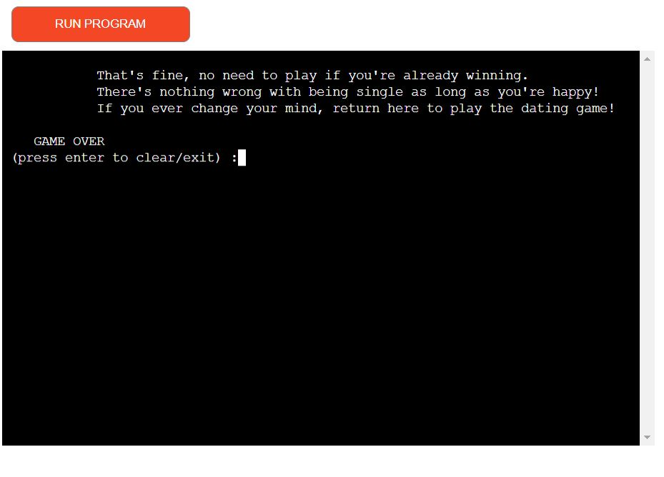

‘y’ results in the rules being explained to player. They will type ‘a’ , ‘b’ or ‘c’ to answer questions. They start with endearment score of 1, if its 10 or higher by the end of the date they win the game. Some actions can result in instant game over , each date has their own preferences, luck is a factor also.

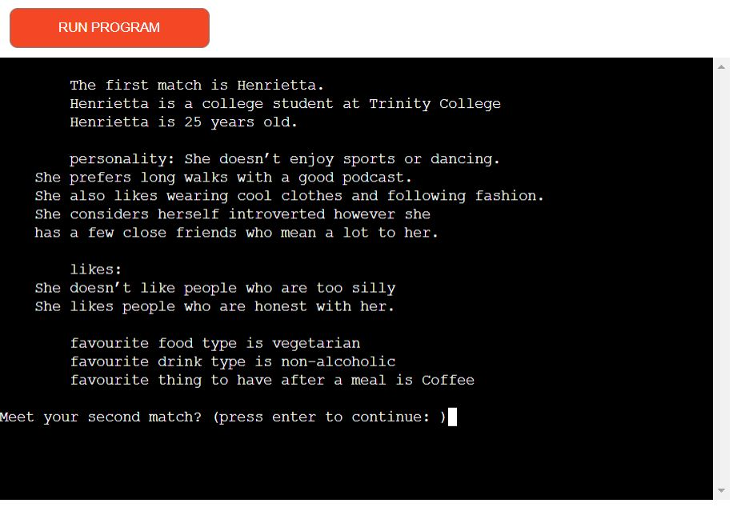

Next , the user is shown character profiles describing the 3 people they have matched with : Henrietta, Francis and Sarah. The profiles describe their vocation, age, personality, likes, food, drink and after-dinner preferences. This info is relevant to the subsequent questions . Between each section, the user is asked to press ‘enter’ to continue. This is important as some of the text is a bit lengthy and will take a minute to read, the user input allows the user to proceed only when they are ready, which means the pace is tailored for the player. 

The player is given the first a, b, or c choice when asked to choose who to go on the date with , Henrietta, Francis or Sarah. They are then asked when to go on the date, tomorrow, this weekend or next week. This choice determines the weather, which affects the first dilemma presented on the date.
With that the date begins, after meeting in town the user must decide what to do. The game advises what the current weather is like , then the user must choose to go straight to the venue, walk in the park, or go inside the shopping centre. If the weather is sunny or snowy a walk in the park gains points, if rainy the shopping centre gains points.

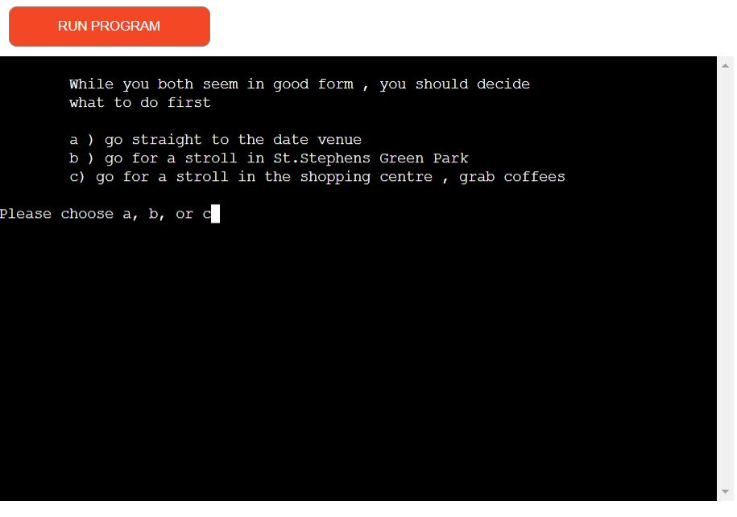

The next section provides a paragraph describing the visuals of the restaurant. I wanted to give the player a visual sense of what the restaurant is like, because its a text based game without images or video. The player must then decide what food to order, points given if they order something their date likes. Each date prefers different food type so the ‘correct’ answer can change from game to game. 
After this the user orders a drink , similarly points are given if it matches the dates preference. Deliberately I didn’t include a ‘correct’ answer for Henrietta here, I like the idea that in some scenarios you just can’t win! Its also amusing for the user to be lectured on their choice when there is no right answer. Furthermore, if the player chooses Dr.Pepper it results in an instant game over. I included this because I thought it was funny and bizarre, users may find it amusing.

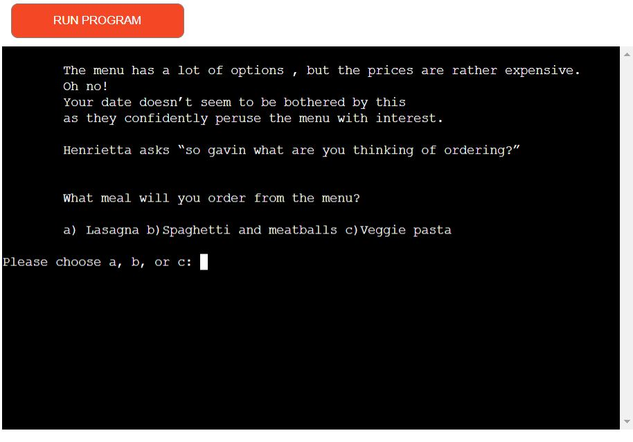

Next is some small talk, the user chooses something to say based on their date’s appearance. Points are gained or lost depending on whether the comment is favourable, based on their date’s character profile. The user then is given the choice of describing their personality, with points lost or gained if it matches or contrasts the date.

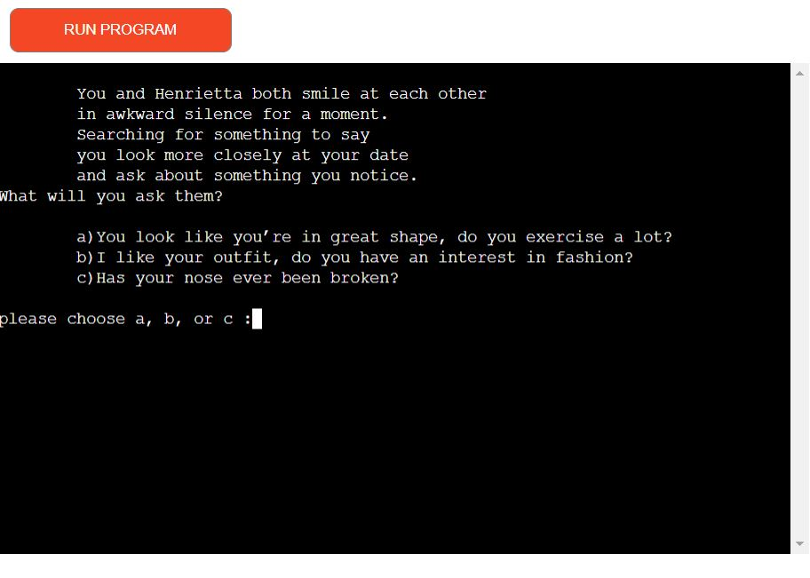

Another dilemma is presented when the wrong food is brought to the date. You can choose whether to swap meals, suggest they send it back, or raise the issue with the waiter yourself. The points here vary depending on what food you ordered yourself to swap, and whether your date will appreciate you pushing to send it back.

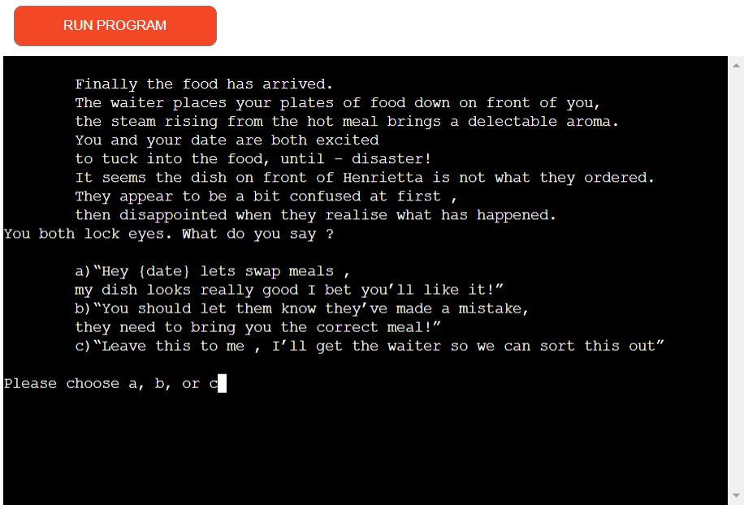

Next is one of 5 possible random encounters, which include a man choking, a couple arguing, a robber bursting in, a rat in the restaurant and the musician asking for a song request. The scenario is random everytime and many of them have instant game over scenarios, or points awarded for good choices. Some will also end the date early while not necessarily resulting in a game over.
After this the user is asked to do something spontaneous with points lost or gained if it matches or contrasts the date’s preference.

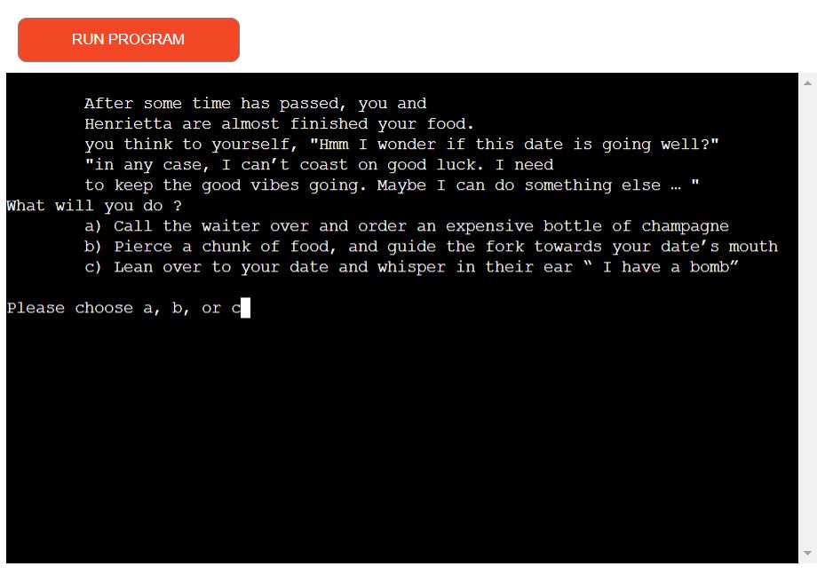

Next the user orders dessert, again points can be gained if its the same preference of their date.
Finally the bill needs to be paid, there are slight variances here for points depending on the character if you offer to pay or split the bill. This isn’t really based on profile comprehension, since the profile info doesn’t advise what their preference would be in this scenario. The user isn’t supposed to have all the info after all, so this is based on intuition / luck.  

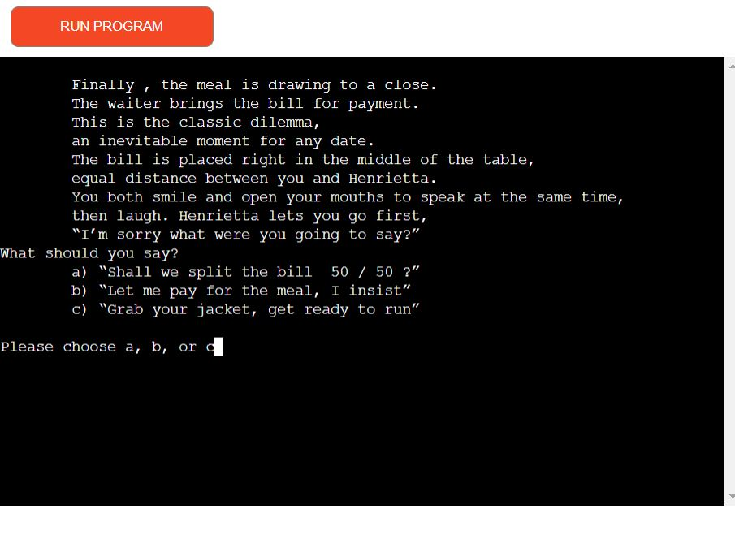

After the date as you prepare to part ways at the luas the user has their final choice. They can hug the date for a point, try for a kiss or try to prolong the date. If the endearment score is 8 or higher the kiss is successful and awards 2 points. The date being prolonged is decided by another random number generator , with a 1 in 5 chance in the date saying yes. This awards 3 points. But even if unsuccessful, the user is given 1 point for asking.

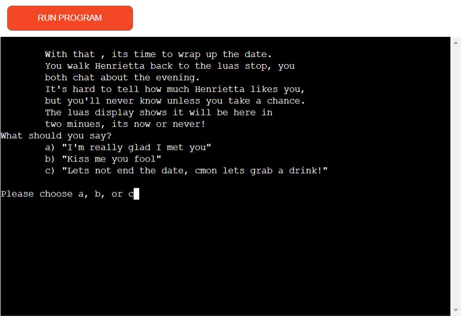

The final part of the game checks the users score, if its 10 or above its a victory and a second date. If its below 10 its a loss and they are declined for a second date. Both provide a bit of flavour text and thank the user for playing the game. It finally clears the text and exits the programme.

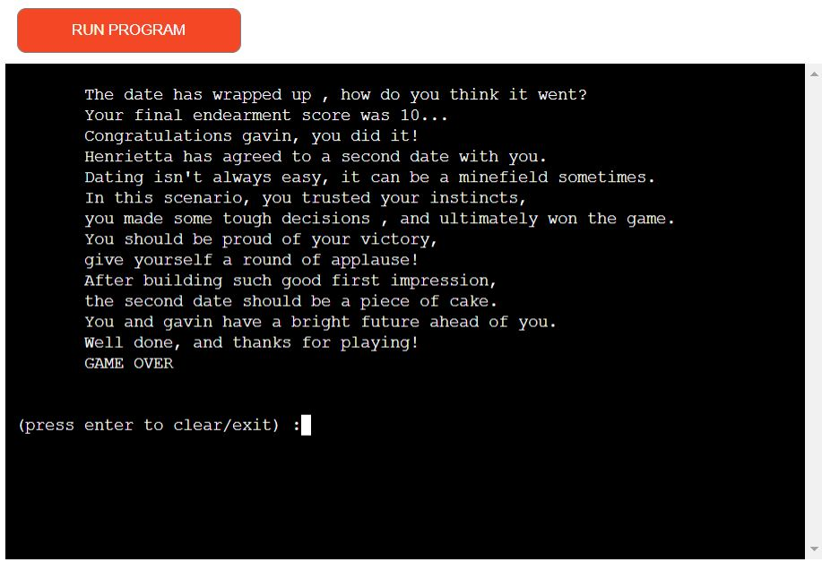

**Instant Game Over**
A few choices can result in an instant game over, regardless of endearment score. These include:
- Ordering a Dr.Pepper
- Attempting to help the choking man by throwing pepper at his nose
- Requesting ‘In the Air Tonight’ from the musician
- Trying to fight the robber in hand to hand combat
- (with Henrietta) Killing the rat by throwing your knife
- (with Henrietta) Ordering a bottle of champagne
- Joking that you have a bomb

These are mostly here for fun and surprise factor. I also feel that if someone chooses some of these extreme options, they are probably not too concerned with doing well on the date, and are more interested in seeing what possibilities the game offers. In any case they provide some humorous content and give the player a chance to think differently on the next playthrough.

**Early Date End**
A few choices cut the date short but don’t necessarily result in a game over. Some offer points to increase the likelihood of a win, or in one case guarantee it. These include 
- Paying and leaving upon seeing the rat
- Requesting Master of Puppets from the musician
- Cooperating peacefully with the robber

## Technologies
- Languages: -python
- GitHub was used to create and hold the repository of - code.
- Git was used to control the terminal, add , commit and push to GitHub
- GitPod was used for the coding environment, based on - Visual Studio Code
- Code-Institute-Org / python-essentials-template
- Python libraries including math, time, os, random
fsymbols font generator for The Dating Game text/image title
- Heroku app to display and run the game on a webpage

## Creation and Deployment
**creation / template :**
The code was created from the Code-Institute-Org / python-essentials-template on GitHub. https://github.com/Code-Institute-Org/python-essentials-template This was accessed by clicking on 'use this template' , choosing a name , description. After this I clicked create repository. Clicked Gitpod , this created a new workspace for me to use in Gitpod , along with tools provided by Code Institute

**Deployment :**
On the GitHub page  https://github.com/gazamcnulty/dating-game-pp3 , I can access my repositories. The repository for the dating game project is located here. Now you can click on 'Settings' , then on the left side click on 'Pages' Click on 'Sources' , click 'Master Branch' From the source section drop-down menu, select the Master Branch This causes the page to refresh and show a confirmation that indicates successful deployment. However as the project does not have a live html / css page for external view , it can only be viewed externally by using the Heroku app
see here for further info on deployment/ publishing https://docs.github.com/en/pages/getting-started-with-github-pages/configuring-a-publishing-source-for-your-github-pages-site

**cloning the repository**
 On the main repository page on GitHub, click code, then copy the url. If on windows, you have to use Command Line with git bash to move it to the local directory. This can be done with the Terminal on Mac. In whichever tool, type "git clone" into the command line then paste in the copied url and press the Enter key to clone the repository
see here for further info on cloning a repository https://docs.github.com/en/repositories/creating-and-managing-repositories/cloning-a-repository

**fork the repository**
From the main repository page on GitHub, got to the top and click on 'fork' . Choose an owner for the new fork (this would be your own github username if its yourself). select the name for the new fork per github "forks are named the same as their upstream repositories. You can change the name of the fork to distinguish it further”. Include a description . choose to copy default or all branches. as standard, just the default is needed. click 'create fork' to complete the fork process
see here for further info on forking https://docs.github.com/en/get-started/quickstart/fork-a-repo

**Deploying on heroku :**
Per the Code Institute instructions, I created an app on Heroku. With this  I added two buildpacks from the Settings tab : heroku/python +  heroku/nodejs
Then I created a Config Var called PORT set to 8000

## Validation and testing
**errors and validation :**
The Code Institute CI Python Linter was used to validate the python code from PEP8 standard.
It initially found many errors, mainly trailing white lines or too much blank space. These were corrected and then after testing again , all 3 .py files returned 'All clear, no errors found.
I consider this a pass in validation.

The Heroku app ran the dating game in Chrome, Edge, Firefox, Safari successfully, in windows and mac. 
I consider this a pass for browsers.

I encountered an issue with Heroku in the browser, where ‘os.system('clear')’  does not successfully clear all of the text per my commands in the python code. It cleared all text as intended when testing it in the terminal on GitPod but for some reason the heroku app kept the text content from the character profiles. Although it would move them above the screen where the user can’t see, the scroll tab on the right enabled the user to scroll back up and see the profile info was still there.

This issue only affects the profile info, in the dictionaries and accessed by the profiles_function in profiles.py. I tried a few different things like taking it out of the function, running it directly from run.py but the profile text would remain above in the heroku app window.
It doesn’t occur in GitPod, only on the heroku app in the browser.
This isn’t a huge issue, as it doesn’t stay on screen. If the user is just playing the game as intended, by typing a b or c, they wont see the text above. But it is less than ideal as it creates a scroll bar on the left, which can distract from the main focus of the game.
In the future I will investigate this further and I would hope to be able to remove the issue completely from future versions of this programme.

**scenario testing :**
I tested the dating game by answering all of the questions with all possible answers, with all 3 dates. This was to confirm that the game worked as intended, awarded the correct amount of points and triggered functions in the correct order. I encountered a few unexpected results, for example orderting Dr.Pepper with Henrietta did not result in gameover, instead it acted as though I had ordered beer or wine. I found this was because of how the question was structured. I made the option c Dr.Pepper choice the first option, with others listed afterward, this caused option c to be prioritised if chosen.

As well as this, I encountered a few instances where the game asked the user to ‘press enter’ to continue, a few times in a row. I found this was an error, from having the input as an option in an if/else statement, then also placed at the end of the function. I fixed this by only having the nested input when it triggered a seperate function.

Beyond this , all of the possible answers do show as correct and yield the correct amount of answers as intended , the dating game is working as intended.

## Known bugs and issues
As I mentioned in the Testing section, I found an issue with Heroku in the browser, where ‘os.system('clear')’  does not successfully clear all of the text per my commands in the python code. This does not occur in the terminal , in GitPod. It only seems to occur in Heroku app in the browser and it only affects the profiles dictionaries in profiles.py. It seems to be related to how the python file is interpreted by a 3rd party app, I unfortunately was unable to resolve it.
Fortunately it does not affect the display or remain on screen, all visible text on the heroku screen is the intended result from the game. What does happen, is that the text is accessible above the viewable section and it is possible to scroll up and read the profiles section. It is a concern that the user may notice the scroll bar and scroll up, becoming distracted from the main focus of the game. However , if the user follows instructions by just typing out the answers it shouldn’t be a problem.
This is something I intend to research and resolve in future iterations of this project.

## Future updates / places to improve
- As I mentioned above I would hope to resolve the issue regarding the profiles text remaining, when I had intended it to be removed with system.clear method
- I would like to improve more scenarios, or possibly a completely alternate date type. For example , you could choose if you want to go the restaurant, or a bar, or the cinema etc
- I would like to increase random chance and more replayability
- I would like to increase user input by having more than just a, b, or c questions

## Acknowledgements and credits
- I used the structure of my readme file from my previous code institute project, 
 	PP2-Star-Trek-Quiz   https://github.com/gazamcnulty/PP2-Star-Trek-Quiz
as a template to create this readme file

-	I learned of the time delay method in python from 
https://www.programiz.com/python-programming/time/sleep

- I learned of the clear method in python from 
https://www.scaler.com/topics/how-to-clear-screen-in-python/

- I learned of the random number generator from 
https://www.programiz.com/python-programming/examples/random-number

- I used the following site to generate the text art for the title
https://fsymbols.com/generators/carty/

- I used W3schools to check the syntax of many different types of code, throughout the process.
I would like to thank my mentor Brian Macharia for his feedback and tips for this project

